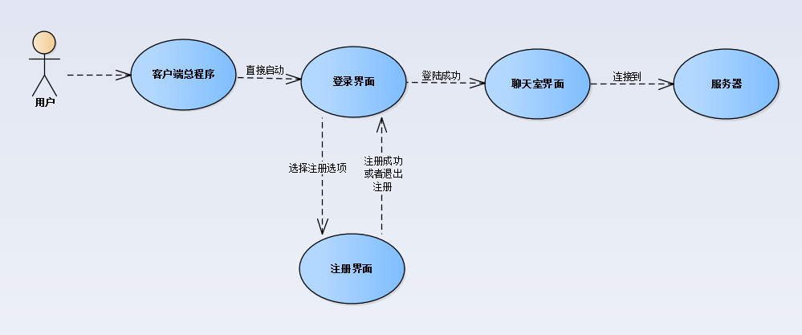

# JavaChatroom
>A java chat room for LAN user.   
>This is an application I followed a Java book to develop a chatroom.   
>P.S.: For this project, I used text document to store the data of user and chatting records (to save time). If you want to use the application to build a robust system, you should try to use database like MySQL.   

## System Design:  
>The chat room has two kinds of users: user and administrator.  
>For users, they can register, login, and chat with other after login.  

## Function & UI:  
### 
## Reference:   
>刘志成:《Java程序设计案例教程》
